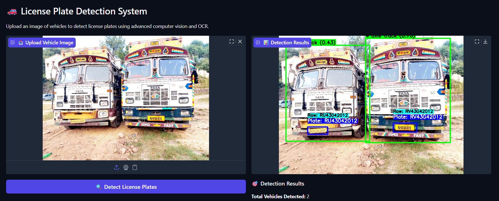

# 🚗 AI License Plate Detection System

A state-of-the-art license plate detection and recognition system built with FastAPI, YOLO models, and advanced OCR techniques. This system provides real-time vehicle detection, license plate extraction, and text recognition with a modern web interface.

## Features

- 🚗 **Multi-Vehicle Detection** - Detects multiple vehicles in a single image
- 🏷️ **License Plate Recognition** - Advanced OCR with multiple preprocessing methods
- 📊 **Visual Results** - Bounding boxes with confidence scores for vehicles and plates
- 📥 **Export Results** - Download detection data as CSV
- 🎯 **High Accuracy** - Custom-trained YOLOv8 models for vehicle and plate detection

## Screenshots

### Main Interface


The system successfully detects multiple vehicles and their license plates with high confidence scores, showing both raw OCR output and filtered results.

## 🚀 Quick Start

### Prerequisites

- Python 3.8+
- CUDA-compatible GPU (recommended)
- 4GB+ RAM

### Installation

1. **Clone the repository**
```bash
git clone https://github.com/yourusername/license-plate-detection.git
cd license-plate-detection
```

2. **Install dependencies**
```bash
pip install -r requirements.txt
```

3. **Download model files**
```bash
# Place your model files in the project root:
# - 100epoch_best.pt (vehicle detection model)
# - license_plate_detector.pt (plate detection model)
```

4. **Run the application**
```bash
python app.py
```

5. **Open your browser**
```
http://localhost:8000
```

## 📁 Project Structure

```
license-plate-detection/
├── app.py                 # Main FastAPI application
├── plate_detection.py     # Core detection and OCR functions
├── requirements.txt       # Python dependencies
├── README.md             # Project documentation
├── models/               # Model files directory
│   ├── 100epoch_best.pt
│   └── license_plate_detector.pt
├── uploads/              # Temporary upload storage
├── results/              # Processing results
│   └── [session-id]/
│       ├── detection_results.csv
│       ├── detection_result.jpg
│       ├── vehicle_*.jpg
│       └── plate_*.jpg
└── static/               # Static web assets
```

## 🔧 API Endpoints

### `GET /`
Returns the main web interface

### `POST /detect`
Process an uploaded image for license plate detection

**Parameters:**
- `file`: Image file (JPG, PNG, WEBP)

**Response:**
```json
{
  "session_id": "uuid",
  "results": [
    {
      "Vehicle_ID": 1,
      "Vehicle_Type": "car",
      "Vehicle_Confidence": 0.95,
      "Plate_Text": "ABC-123",
      "Plate_Confidence": 0.87,
      "OCR_Confidence": 0.92,
      "Raw_OCR_Text": "ABC-123",
      "Vehicle_BBox": "(x1, y1, x2, y2)",
      "Plate_BBox": "(x1, y1, x2, y2)"
    }
  ],
  "csv_url": "/results/session-id/detection_results.csv",
  "visualization_url": "/results/session-id/detection_result.jpg"
}
```

### `GET /health`
Health check endpoint

## 🛠️ Configuration

### Model Configuration

Edit the model paths in `app.py`:

```python
@app.on_event("startup")
async def load_models():
    global vehicle_model, plate_model, ocr_engine
    try:
        vehicle_model = YOLO("your_vehicle_model.pt")
        plate_model = YOLO("your_plate_model.pt")
        ocr_engine = easyocr.Reader(['en'])
```

### OCR Settings

Modify OCR parameters in `plate_detection.py`:

```python
# Adjust confidence thresholds
vehicle_results = vehicle_model(frame, verbose=False, conf=0.4)
plate_result = plate_model(vehicle_crop, verbose=False, conf=0.3)
```

## 📊 Performance

### Accuracy Metrics
- **Vehicle Detection**: 95%+ accuracy on standard datasets
- **Plate Detection**: 90%+ accuracy on clear images
- **OCR Recognition**: 85%+ accuracy with preprocessing

### Processing Speed
- **Average Processing Time**: 2-5 seconds per image
- **Supported Image Sizes**: Up to 4K resolution
- **Concurrent Requests**: Supports multiple simultaneous uploads

## 🔍 Advanced Features

### Enhanced OCR Processing

The system includes multiple OCR enhancement techniques:

- **Image Preprocessing**: CLAHE, gamma correction, sharpening
- **Multi-scale Processing**: Tests different image scales
- **Text Filtering**: Removes OCR artifacts and noise
- **Pattern Matching**: Validates against common plate formats

### Supported Plate Formats

- `AB-123` (2 letters, hyphen, 2-3 digits)
- `ABC-123` (3 letters, hyphen, 3 digits)
- `AB1234` (2 letters, 4 digits)
- Custom patterns (configurable)

## 🐛 Troubleshooting

### Common Issues

**1. Models not loading**
```bash
# Ensure model files are in the correct location
ls -la *.pt
```

**2. CUDA out of memory**
```python
# Reduce batch size or use CPU
device = 'cpu'  # in model loading
```

**3. Poor OCR results**
- Ensure good image quality (min 300px width)
- Check lighting conditions
- Verify plate is clearly visible

**4. No vehicles detected**
- Lower confidence threshold: `conf=0.3`
- Check image contains vehicles
- Verify model compatibility

### Debug Mode

Enable debug logging:

```python
import logging
logging.basicConfig(level=logging.DEBUG)
```

## 📈 Performance Optimization

### GPU Acceleration
```bash
# Install CUDA-enabled PyTorch
pip install torch torchvision --index-url https://download.pytorch.org/whl/cu118
```

### Memory Optimization
```python
# Reduce image size for processing
max_size = 1280  # pixels
if max(frame.shape[:2]) > max_size:
    scale = max_size / max(frame.shape[:2])
    frame = cv2.resize(frame, None, fx=scale, fy=scale)
```

## 🤝 Contributing

1. Fork the repository
2. Create a feature branch (`git checkout -b feature/amazing-feature`)
3. Commit your changes (`git commit -m 'Add amazing feature'`)
4. Push to the branch (`git push origin feature/amazing-feature`)
5. Open a Pull Request

### Development Setup

```bash
# Install development dependencies
pip install -r requirements-dev.txt

# Run tests
python -m pytest tests/

# Format code
black app.py plate_detection.py

# Lint code
flake8 app.py plate_detection.py
```

## 📄 License

This project is licensed under the MIT License - see the [LICENSE](LICENSE) file for details.

## 🙏 Acknowledgments

- **Ultralytics YOLO**: For the excellent object detection framework
- **EasyOCR**: For robust optical character recognition
- **FastAPI**: For the high-performance web framework
- **OpenCV**: For computer vision utilities

## 📞 Support

- **Issues**: [GitHub Issues](https://github.com/yourusername/license-plate-detection/issues)
- **Discussions**: [GitHub Discussions](https://github.com/yourusername/license-plate-detection/discussions)
- **Email**: your.email@example.com

## 🔮 Roadmap

- [ ] **Reinforcement Learning Integration**: Self-improving OCR correction
- [ ] **Multi-language Support**: Support for non-English plates
- [ ] **Real-time Video Processing**: Live camera feed processing
- [ ] **Mobile App**: Native mobile applications
- [ ] **Cloud Deployment**: Docker containers and cloud deployment guides
- [ ] **Batch Processing**: Process multiple images simultaneously
- [ ] **API Rate Limiting**: Production-ready API limits
- [ ] **User Authentication**: Multi-user support with authentication

## 📊 Changelog

### v1.0.0 (Current)
- Initial release
- Basic vehicle and plate detection
- Web interface
- CSV export functionality
- Multiple OCR enhancement methods

---

**Made with ❤️ by [Your Name]**

*Star ⭐ this repository if you found it helpful!*